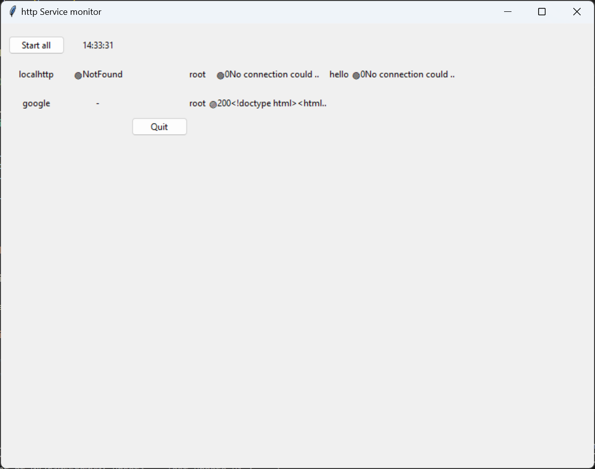

This is a simple python gui application for monitoring services as processes and http requests.
Currently only supports HTTP GET.

## Install requirements
pip install tk
pip install pyttk
pip install jstyleson

## Look


## Configuration
Inside [svcs.json](svcs.json) specify name of service and its root url.
Then optionally its process name and path to it. (Not used now)
Inside endpoints specify multiple endpoints and a suffix which is added to  service root url when GET request is sent.
Now background thread minotors each 500ms all services endpoints and displays the result of the call.

## Test client in go
Simple http server listening on localhost:3333/ and /hello

Prereq: golang
Run:
```
cd .\go-simple-api\
go run .\main.go
```

## Create .exe
pip install pyinstaller

